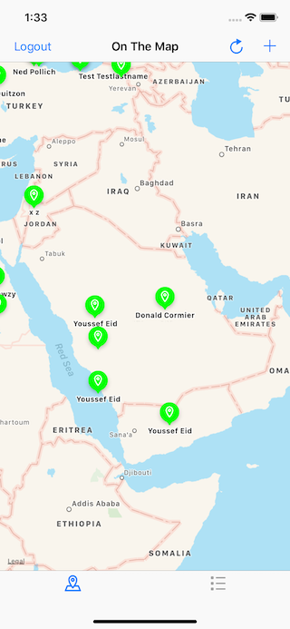

# YSOnTheMap
A meme generator in Swift 4 of the Fourth app for Udacity's iOS Nanodegree program

---------------------------------------------------------------------------------------------

## What is YSOnTheMap
Students can learn how to use maps and access the Internet and how they work

  

## Compatibility
Swift 4

## Problems?
Send me an [email](mailto:arabphone.sa@gmail.com) if you encounter any problems.

## Credits
Original graphical assets were provided by Udacity.
The concept for this app was presented during the iOS Nanodegree programme provided by Udacity.

## License
Freely provided under [The MIT License](https://en.wikipedia.org/wiki/MIT_License).

